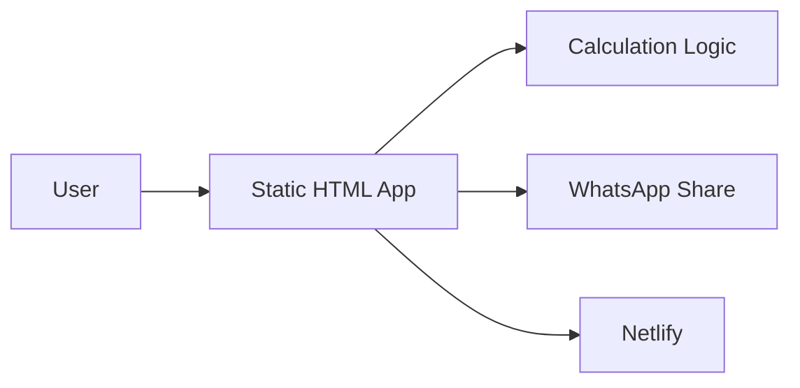

# BuildCalc — Construction Cost Estimator for India

BuildCalc is a client-side construction cost estimator for Indian projects, with city-specific inputs, material calculations, GST, wastage, soil surcharge, contractor margin, payment schedules, and WhatsApp sharing.

## Live Demo
https://buildcalc-india.netlify.app

## Architecture
See [`docs/architecture.md`](docs/architecture.md).

## Features
- Material cost calculation for cement, steel, bricks, and sand
- City-specific rates for Hyderabad, Bangalore, Mumbai, and Delhi NCR
- GST and wastage adjustments
- Black Cotton Soil foundation surcharge
- Contractor profit margin calculator
- Stage-wise payment schedule
- WhatsApp estimate sharing

## Measurement / evidence
| Metric | Status |
|---|---|
| Calculation latency | Not yet benchmarked reproducibly |
| Calculation accuracy | Not yet validated against a labeled/reference dataset |
| Error rate | Not yet benchmarked |

Do not put accuracy or performance numbers on the resume until they are measured and documented with a reproducible test setup.

## Tech Stack
HTML5, CSS3, JavaScript, Netlify

## Developer
Mohammed Owais Naj Muddin
