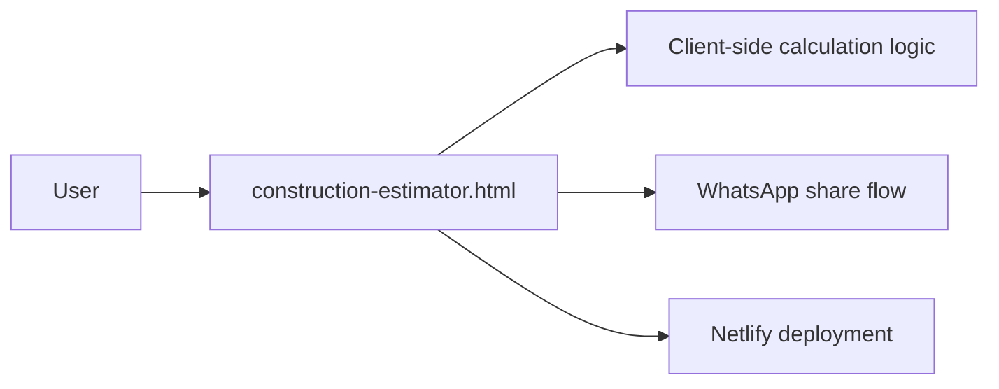

# BuildCalc Architecture

## Current repository architecture

BuildCalc is currently a single static HTML application. The public repository does not contain a separate backend or database layer.

## Evidence boundary
The architecture above reflects the files currently committed to the repository. Do not claim a backend/API/database architecture unless those components are actually added and documented.
